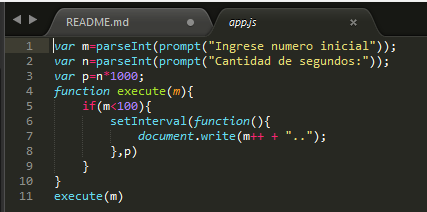

# ejer3_leccion20
1. Declaro la variable m para que el usuario ingrese el número inicial.
2. Declaro la variable n para que el usuario ingrese la cantidad de segundos.
3. Declaro la variable p y en ellla almaceno la operación n*1000
4. En la función execute pongo una condicón donde m<100 y dentro de ella mi funcio setInterval , esta funcion me permitira ejecutar la funcion en un determinado tiempo en este caso 2s me mostrara el mensaje 
